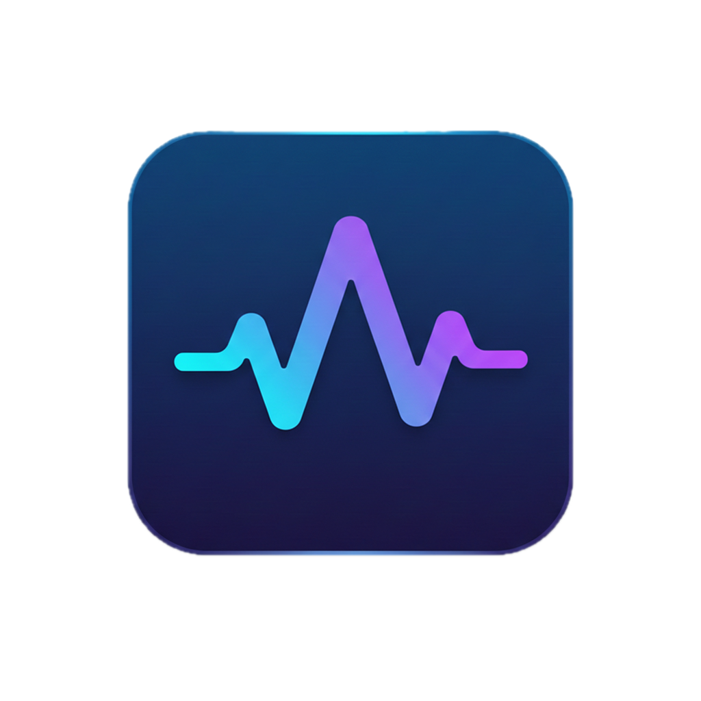

<div align="center">
  

  <h1>AIRecorder</h1>

  <p>Desktop audio recorder with AI-powered transcription, summaries, and chat</p>

  
  
  
  
  
  
</div>

---

## What is AIRecorder?

AIRecorder captures both your **microphone** and **system audio** simultaneously, transcribes them with [OpenAI Whisper](https://github.com/openai/whisper), and lets you chat with the content using your AI provider of choice — all running locally or via cloud APIs.

Perfect for meetings, interviews, lectures, and any audio you need to revisit.

## Features

- **Dual-channel recording** — captures microphone and system audio as separate tracks
- **AI transcription** — powered by [faster-whisper](https://github.com/SYSTRAN/faster-whisper), runs locally with no data sent to the cloud
- **Multiple AI providers** — Gemini, Ollama, LM Studio, DeepSeek, Kimi
- **Chat with recordings** — ask questions about any transcription
- **Projects** — group recordings, generate summaries, timelines and task suggestions
- **Transcription queue** — processes recordings one at a time in the background
- **Multi-language UI** — Spanish and English support via i18next

## Tech Stack

| Layer | Technology |
|-------|-----------|
| Desktop shell | Electron 31 |
| Frontend | React 18 + Vite + TailwindCSS |
| Database | SQLite via better-sqlite3 |
| Transcription | Python 3 + faster-whisper |
| AI chat | Gemini / Ollama / LM Studio / DeepSeek / Kimi |
| State management | Redux Toolkit |

## Getting Started

### Prerequisites

- [Node.js](https://nodejs.org/) v20+
- [Python](https://www.python.org/) 3.10+

### Installation

```bash
# 1. Clone the repository
git clone https://github.com/rgarciade/airecorder.git
cd airecorder

# 2. Install Node dependencies
npm install

# 3. Rebuild native modules for Electron
npm rebuild better-sqlite3 --runtime=electron --target=31.7.7 --dist-url=https://electronjs.org/headers --build-from-source

# 4. Install Python dependencies
pip install -r requirements.txt
```

### Run in development

```bash
npm run dev
```

This starts Vite (port 5173) and Electron concurrently. Hot reload is enabled for the React frontend.

## Project Structure

```
airecorder/
├── electron/               # Main process (Node.js / Electron)
│   ├── ipc-handlers/       # IPC communication handlers
│   ├── services/           # Transcription queue, audio, update checker
│   └── database/           # SQLite schema, queries, migrations
├── src/                    # Renderer process (React)
│   ├── pages/              # Full-page views (Home, Projects, Settings…)
│   ├── components/         # Reusable UI components
│   └── services/           # Audio capture, AI providers, Redux store
├── python/                 # Audio processing & transcription backend
│   └── audio_sync_analyzer.py
├── scripts/                # Build utilities (obfuscation, ASAR protection…)
└── requirements.txt        # Python dependencies
```

> Each major folder has its own `README.md` with in-depth documentation.

## Building for Production

### macOS (DMG)

```bash
npm run electron:build
```

Outputs `dist-electron/AIRecorder-<version>-arm64.dmg`.

The build pipeline:
1. Compiles Python with PyInstaller
2. Builds the React frontend with Vite
3. Obfuscates Electron source
4. Packages with electron-builder
5. Applies ASAR protection

### Windows

Windows builds are not yet automated. Run the app in development mode with `npm run dev`.

## Contributing

Contributions are welcome! Here is how to get started:

1. Fork the repository
2. Create a feature branch: `git checkout -b feature/my-feature`
3. Make your changes and commit: `git commit -m 'feat: add my feature'`
4. Push to your branch: `git push origin feature/my-feature`
5. Open a Pull Request

### Commit convention

This project follows [Conventional Commits](https://www.conventionalcommits.org/):

| Prefix | Use for |
|--------|---------|
| `feat:` | New features |
| `fix:` | Bug fixes |
| `chore:` | Maintenance, dependencies |
| `docs:` | Documentation changes |
| `refactor:` | Code refactoring |

### Running the Python script manually

The transcription pipeline is resilient to partial recordings: if one track is empty, undecodable, has zero duration, or is effectively silent, the analyzer skips that track and still transcribes the valid one. It also discards implausible synchronization lags instead of trimming almost the entire clip. The process only fails when both tracks are unusable.

```bash
python python/audio_sync_analyzer.py \
  --basename <recording-folder-name> \
  --base_dir <path-to-recordings> \
  --model small \
  --threads 4
```

### Diarización y Extracción de Embeddings

Cuando la diarización está habilitada (Ajustes → HuggingFace Token), el pipeline ejecuta `diarization_analyzer.py` como paso previo a la transcripción. A partir de la versión `2.0` del schema de salida, el JSON generado tiene el siguiente formato:

```json
{
  "version": "2.0",
  "segments": [
    { "start": 0.0, "end": 3.5, "speaker": "SPEAKER_00" },
    { "start": 3.8, "end": 7.2, "speaker": "SPEAKER_01" }
  ],
  "speaker_embeddings": {
    "SPEAKER_00": [0.123, -0.045, ...],
    "SPEAKER_01": [0.891, 0.023, ...]
  }
}
```

- **`segments`**: Segmentos de audio con el hablante asignado (mismo formato que en v1.0).
- **`speaker_embeddings`**: Mapa `{ speaker_id: [float] }` con el vector centroide normalizado (L2) de cada hablante. Se calcula promediando los embeddings de todos sus segmentos y normalizando a longitud unitaria. Listo para similitud coseno.

Los embeddings se extraen usando el modelo de embedding interno de `pyannote/speaker-diarization-3.1` (`pipeline._embedding`, tipo `PretrainedSpeakerEmbedding`). El waveform se recorta manualmente por segmento y se pasa como tensor `(1, 1, n_samples)` directamente al modelo. Segmentos menores a 0.5s se descartan antes de la extracción. Si el modelo interno no está accesible, `speaker_embeddings` quedará como `{}` y la transcripción continúa normalmente.

`audio_sync_analyzer.py` es retrocompatible con ambos formatos (lista plana v1.0 y objeto v2.0).

### Umbral de Similitud de Hablantes

El reconocimiento de hablantes usa **similitud coseno** entre embeddings de voz para identificar si un hablante en una nueva grabación coincide con un perfil conocido. El umbral por defecto es **0.85** (85%), configurable en Ajustes → sección de Diarización.

**¿Cómo funciona?**
- Valor entre 0.50 y 0.99 (slider en UI).
- **Valores bajos** (más permisivo): mayor probabilidad de falsos positivos — une voces de personas diferentes que suenan similar.
- **Valores altos** (más estricto): mayor probabilidad de falsos negativos — separa la misma voz en hablantes diferentes.

**Para ajustar**: Ve a Ajustes → General → Diarización de Interlocutores → Slider "Umbral de similitud de hablantes". El cambio se aplica a las siguientes grabaciones procesadas.

### Regla de Mantenimiento de Archivos

⚠️ **OBLIGATORIO**: Si un archivo de código fuente supera las ~300 líneas, es una señal de que necesita ser dividido.

**Criterios de división:**
- Si concentra demasiada lógica de negocio → separar en módulos más pequeños por contexto
- Si tiene múltiples responsabilidades → separar en archivos especializados
- Los módulos deben ser autocontenidos y poder entenderse de forma independiente

Esta regla aplica a TODOS los archivos del proyecto (JavaScript, Python, configuración, etc.).

## License

MIT © [Raul Garcia](https://github.com/rgarciade)
